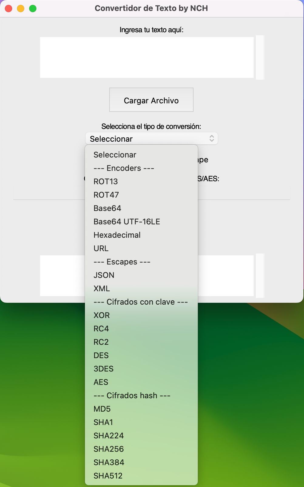

# gui-encoder

# Run
```bash
python3 main.py
```

### Install (for macOS)
```bash
git clone https://github.com/nchgroup/gui-encoder
cd gui-encoder
python3 -m venv venv
source venv/bin/activate
python3 -m pip install -r requirements.txt
brew install python-tk
```

## Screenshots

### Main Window


### Encode Window
